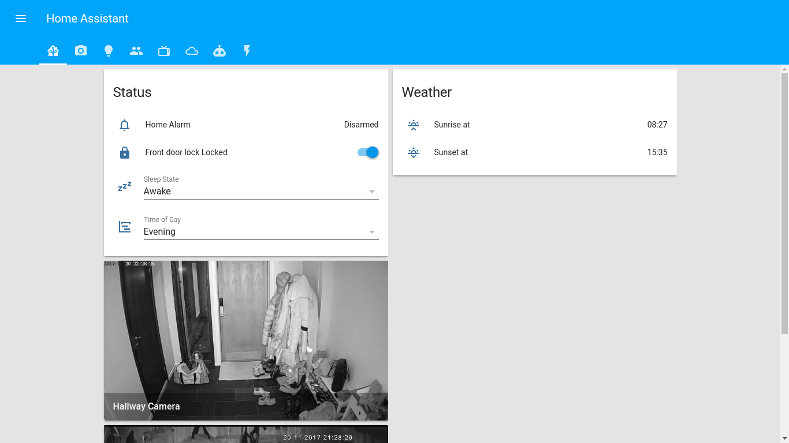
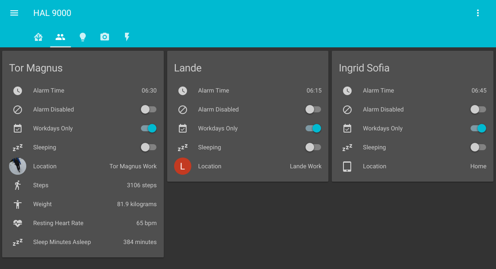
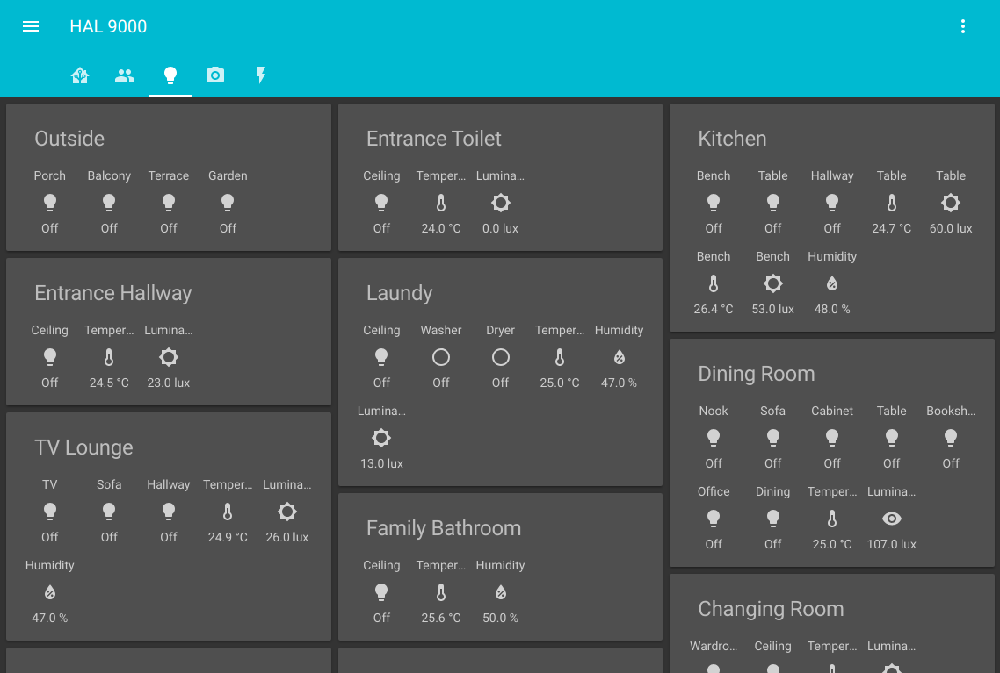
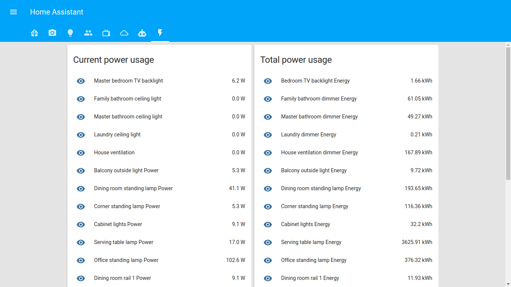

# My Home Assistant Config

My Home Assistant installtion runs in docker on a NUC running Ubuntu 17.04:

Also using Prometheus/Grafana for graphing, both running in Docker containers. 
 

# Interface
  
  

